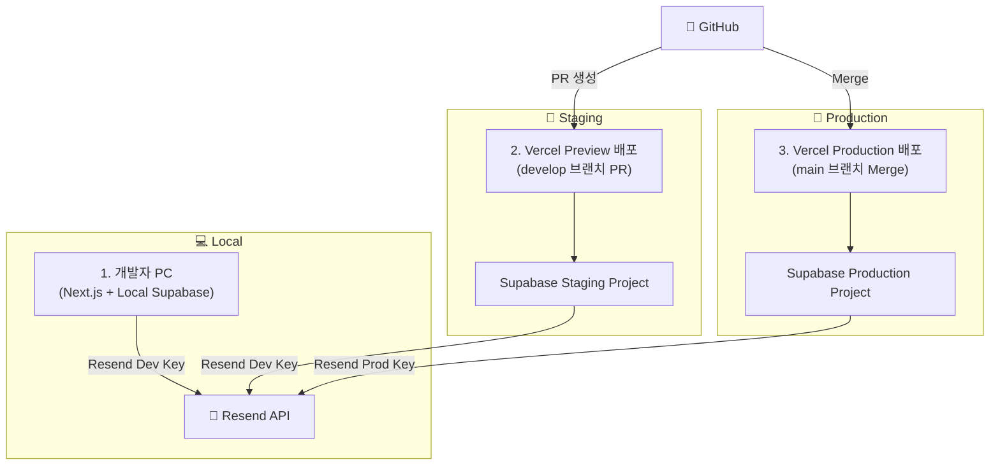

# 배포 가이드 - AcaDesk Web

**Local**, **Staging**, **Production** 환경에 AcaDesk를 배포하는 완전한 가이드입니다.

## 목차

- [개요](#개요)
- [환경 아키텍처](#환경-아키텍처)
- [사전 요구사항](#사전-요구사항)
- [로컬 개발 환경 설정](#로컬-개발-환경-설정)
- [Staging 환경 설정](#staging-환경-설정)
- [Production 환경 설정](#production-환경-설정)
- [배포 워크플로우](#배포-워크플로우)
- [이메일 서비스 설정 (Resend)](#이메일-서비스-설정-resend)
- [개발 워크플로우 시각화](#개발-워크플로우-시각화)
- [문제 해결](#문제-해결)

---

## 개요

AcaDesk는 **3단계 환경 전략**을 사용합니다:

**핵심 철학: 모든 것을 분리하라 (Separate Everything)**

각 환경(Local, Staging, Production)은 서로를 전혀 알지 못하는 독립된 섬이어야 합니다. 각 환경은 자체적인 Supabase 프로젝트, Resend API 키, Resend 도메인을 가지며, 모든 연결은 환경 변수를 통해 동적으로 이루어집니다.

| 환경 | 목적 | Supabase | Vercel | 도메인 | Resend API | Resend 도메인 |
|------|------|----------|--------|--------|-----------|--------------|
| **Local** | 개발 환경 | Supabase CLI (로컬) | 해당 없음 | `localhost:3000` | Development Key | `staging.mydomain.com` |
| **Staging** | 프로덕션 전 테스트 | 별도 Supabase 프로젝트 | Vercel preview | `acadesk-staging.vercel.app` | Development Key | `staging.mydomain.com` |
| **Production** | 실제 서비스 | 별도 Supabase 프로젝트 | Vercel production | `your-domain.com` | Production Key | `mydomain.com` |

---

## 환경 아키텍처

```
┌─────────────────────────────────────────────────────────────┐
│                     PRODUCTION                              │
│  ┌──────────────┐           ┌─────────────────┐            │
│  │   Vercel     │  ←──────→ │ Supabase Cloud  │            │
│  │  Production  │           │  (Production)   │            │
│  └──────────────┘           └─────────────────┘            │
│   your-domain.com              메인 프로젝트                 │
└─────────────────────────────────────────────────────────────┘

┌─────────────────────────────────────────────────────────────┐
│                      STAGING                                │
│  ┌──────────────┐           ┌─────────────────┐            │
│  │   Vercel     │  ←──────→ │ Supabase Cloud  │            │
│  │   Staging    │           │   (Staging)     │            │
│  └──────────────┘           └─────────────────┘            │
│   staging.vercel.app          별도 프로젝트                  │
└─────────────────────────────────────────────────────────────┘

┌─────────────────────────────────────────────────────────────┐
│                       LOCAL                                 │
│  ┌──────────────┐           ┌─────────────────┐            │
│  │  Next.js Dev │  ←──────→ │ Supabase CLI    │            │
│  │   Server     │           │    (Docker)     │            │
│  └──────────────┘           └─────────────────┘            │
│   localhost:3000               localhost:54321              │
└─────────────────────────────────────────────────────────────┘
```

---

## 사전 요구사항

### 필수 도구

- **Node.js**: v20 이상 ([설치하기](https://nodejs.org/))
- **pnpm**: v10.17.1 이상 (`npm install -g pnpm`)
- **Supabase CLI**: 최신 버전 (`brew install supabase/tap/supabase`)
- **Docker Desktop**: 로컬 Supabase용 ([설치하기](https://www.docker.com/products/docker-desktop/))
- **Git**: 버전 관리용

### 필수 계정

- **Supabase 계정**: [supabase.com](https://supabase.com)
- **Vercel 계정**: [vercel.com](https://vercel.com)
- **Resend 계정**: 이메일 발송용 ([resend.com](https://resend.com))
- (선택) **Sentry 계정**: 에러 모니터링용 ([sentry.io](https://sentry.io))

---

## 로컬 개발 환경 설정

### 1. 저장소 클론

```bash
git clone https://github.com/your-org/acadesk-web.git
cd acadesk-web
```

### 2. 의존성 설치

```bash
pnpm install
```

### 3. 환경 변수 설정

```bash
# 예제 환경 변수 파일 복사
cp .env.example .env.local

# .env.local을 로컬 Supabase 크레덴셜로 수정
# (Supabase CLI 시작 후 값을 얻을 수 있습니다)
```

### 4. Supabase 로컬 인스턴스 시작

```bash
# Supabase 시작 (처음 실행 시 몇 분 소요)
supabase start

# 시작이 완료되면 다음과 같은 출력을 볼 수 있습니다:
# API URL: http://127.0.0.1:54321
# anon key: eyJhbG...
```

`API URL`과 `anon key`를 `.env.local`에 복사하세요:

```env
NEXT_PUBLIC_SUPABASE_URL=http://127.0.0.1:54321
NEXT_PUBLIC_SUPABASE_ANON_KEY=<supabase_start에서_얻은_anon_key>
NEXT_PUBLIC_APP_URL=http://localhost:3000
NEXT_PUBLIC_ENV=local
```

### 5. 데이터베이스 마이그레이션 실행

```bash
# 마이그레이션은 Supabase CLI에 의해 자동으로 적용됩니다
# 확인하려면:
supabase db reset  # 모든 마이그레이션을 초기화하고 다시 적용
```

### 6. 개발 서버 시작

```bash
pnpm dev
```

[http://localhost:3000](http://localhost:3000)을 방문하여 앱을 확인하세요.

### 유용한 로컬 명령어

```bash
# Supabase Studio (데이터베이스 UI) 열기
# http://localhost:54323 방문

# Supabase 중지
supabase stop

# Supabase 상태 확인
supabase status

# 새 마이그레이션 생성
supabase migration new <migration_name>
```

---

## Staging 환경 설정

### 1. Staging Supabase 프로젝트 생성

1. [Supabase 대시보드](https://supabase.com/dashboard)로 이동
2. "New Project" 클릭
3. 이름 설정: `acadesk-staging`
4. 리전 선택: (사용자와 가장 가까운 지역)
5. 강력한 데이터베이스 비밀번호 설정 (안전하게 보관)
6. 프로젝트 생성 대기 (~2분)

### 2. Staging에 데이터베이스 마이그레이션 적용

```bash
# staging 프로젝트에 연결
supabase link --project-ref <staging-project-ref>

# 모든 마이그레이션을 staging으로 푸시
supabase db push
```

### 3. Vercel Staging 프로젝트 설정

1. [Vercel 대시보드](https://vercel.com/dashboard)로 이동
2. Git 저장소 Import
3. 프로젝트 설정:
   - **Framework Preset**: Next.js
   - **Root Directory**: `./`
   - **Build Command**: `pnpm build`
   - **Output Directory**: `.next`

### 4. Staging 환경 변수 설정

Vercel 대시보드 > Project Settings > Environment Variables에서:

다음 변수를 **Environment**: `Preview` 및 `Development`로 추가:

```env
NEXT_PUBLIC_SUPABASE_URL=<staging-supabase-url>
NEXT_PUBLIC_SUPABASE_ANON_KEY=<staging-anon-key>
NEXT_PUBLIC_APP_URL=<staging-vercel-url>
NEXT_PUBLIC_ENV=staging
NEXT_PUBLIC_ERROR_REPORTING_ENABLED=true
NEXT_PUBLIC_SENTRY_DSN=<선택-sentry-dsn>
SUPABASE_SERVICE_ROLE_KEY=<선택-service-role-key>
```

**Supabase 크레덴셜 얻는 방법:**
- Supabase 대시보드 > Project Settings > API로 이동
- `Project URL`과 `anon public` 키 복사

### 5. Staging에 배포

```bash
# 방법 1: staging 브랜치에 푸시 (자동 배포)
git checkout -b staging
git push origin staging

# 방법 2: Vercel 대시보드에서 수동 배포
# "Deploy" 버튼 클릭
```

### 6. Staging 배포 테스트

Staging URL(예: `https://acadesk-staging.vercel.app`)을 방문하여 확인:
- [ ] 애플리케이션 로드 확인
- [ ] 인증 작동 확인
- [ ] 데이터베이스 쿼리 실행 확인
- [ ] RLS 정책 활성화 확인

---

## Production 환경 설정

### 1. Production Supabase 프로젝트 생성

1. [Supabase 대시보드](https://supabase.com/dashboard)로 이동
2. "New Project" 클릭
3. 이름 설정: `acadesk-production`
4. 리전 선택: (사용자와 가장 가까운 지역)
5. **강력한** 데이터베이스 비밀번호 설정 (안전하게 보관)
6. 프로젝트 생성 대기 (~2분)

### 2. Production에 데이터베이스 마이그레이션 적용

```bash
# production 프로젝트에 연결
supabase link --project-ref <production-project-ref>

# 모든 마이그레이션을 production으로 푸시
supabase db push
```

**⚠️ 중요**: 항상 staging에서 먼저 마이그레이션을 테스트하세요!

### 3. Production 환경 변수 설정

Vercel 대시보드 > Project Settings > Environment Variables에서:

다음 변수를 **Environment**: `Production`으로 추가:

```env
NEXT_PUBLIC_SUPABASE_URL=<production-supabase-url>
NEXT_PUBLIC_SUPABASE_ANON_KEY=<production-anon-key>
NEXT_PUBLIC_APP_URL=<production-domain>
NEXT_PUBLIC_ENV=production
NEXT_PUBLIC_ERROR_REPORTING_ENABLED=true
NEXT_PUBLIC_SENTRY_DSN=<production용-sentry-dsn>
SUPABASE_SERVICE_ROLE_KEY=<service-role-key>
```

### 4. 커스텀 도메인 설정 (선택)

1. Vercel 대시보드 > Project Settings > Domains
2. 커스텀 도메인 추가 (예: `app.acadesk.com`)
3. DNS 설정 안내 따르기
4. SSL 인증서 프로비저닝 대기 (~10분)

### 5. Production 기능 활성화

**Supabase:**
- [ ] 데이터베이스 백업 활성화 (Project Settings > Database > Backups)
- [ ] 인증 프로바이더 설정 (Authentication > Providers)
- [ ] RLS 정책 검토 (Database > Policies)
- [ ] 필요시 웹훅 설정 (Database > Webhooks)

**Vercel:**
- [ ] Production 보호 활성화 (Settings > General > Production Protection)
- [ ] 배포 보호 설정 (Settings > Deployment Protection)
- [ ] 모니터링 설정 (Analytics, Speed Insights)

### 6. Production에 배포

```bash
# main 브랜치에 푸시 (production으로 자동 배포)
git checkout main
git push origin main
```

### 7. 배포 후 체크리스트

- [ ] Production URL 방문 및 기능 확인
- [ ] 사용자 인증 테스트 (회원가입, 로그인, 로그아웃)
- [ ] 핵심 사용자 플로우 테스트 (학생 생성, 출석 기록 등)
- [ ] RLS 정책 활성화 확인
- [ ] 에러 모니터링 대시보드 확인 (Sentry)
- [ ] 이메일 전송 테스트
- [ ] 데이터베이스 백업 활성화 확인
- [ ] 롤백 절차 문서화

---

## 배포 워크플로우

### 기능 개발 플로우

```
┌─────────────┐
│  Local Dev  │  ← 로컬 Supabase로 기능 개발
└──────┬──────┘
       │ git push feature branch
       ▼
┌─────────────┐
│   Staging   │  ← 자동 배포된 preview, staging DB로 테스트
└──────┬──────┘
       │ Merge to staging branch
       ▼
┌─────────────┐
│   Staging   │  ← 완전한 staging 환경 테스트
└──────┬──────┘
       │ QA 후 main에 merge
       ▼
┌─────────────┐
│ Production  │  ← Production으로 자동 배포
└─────────────┘
```

### Git 브랜칭 전략

```
main (production)
  │
  ├─ staging (staging environment)
  │    │
  │    ├─ feature/student-management
  │    ├─ fix/attendance-bug
  │    └─ chore/update-deps
  │
  └─ ...other branches
```

### 마이그레이션 워크플로우

1. **로컬에서 마이그레이션 생성:**
   ```bash
   supabase migration new add_student_notes
   # supabase/migrations/에서 마이그레이션 파일 편집
   ```

2. **로컬에서 테스트:**
   ```bash
   supabase db reset  # 모든 마이그레이션을 새로 적용
   pnpm dev           # 애플리케이션 테스트
   ```

3. **Staging에 적용:**
   ```bash
   supabase link --project-ref <staging-ref>
   supabase db push
   # staging 환경에서 테스트
   ```

4. **Production에 적용:**
   ```bash
   supabase link --project-ref <production-ref>
   supabase db push
   # 문제 모니터링
   ```

---

## 이메일 서비스 설정 (Resend)

### Resend 계정 및 도메인 설정

**1. Resend 계정 생성**
1. [resend.com](https://resend.com)에서 계정 생성
2. API Keys 섹션에서 2개의 API 키 생성:
   - `Production Key` - 프로덕션 환경용
   - `Development Key` - 로컬 및 Staging 환경용

**2. 도메인 등록**
1. Resend 대시보드 > Domains에서 도메인 추가
2. 프로덕션용: `mydomain.com` (실제 도메인)
3. Staging용: `staging.mydomain.com` (서브도메인)
4. DNS 설정 완료 (SPF, DKIM, DMARC 레코드)

**3. 환경별 Secret 설정**

각 Supabase 프로젝트에 Resend API 키를 Secret으로 저장:

```bash
# Production Supabase 프로젝트
supabase secrets set --project-ref <prod-project-ref> RESEND_API_KEY=re_..._ProdKey

# Staging Supabase 프로젝트
supabase secrets set --project-ref <staging-project-ref> RESEND_API_KEY=re_..._DevKey

# Local (supabase 폴더의 .env 파일에 추가)
echo "RESEND_API_KEY=re_..._DevKey" >> supabase/.env
```

### Supabase Edge Function 배포

**1. Edge Function 작성**

`supabase/functions/send-auth-email/index.ts`:

```typescript
import { serve } from "https://deno.land/std@0.168.0/http/server.ts"

serve(async (req) => {
  const resendApiKey = Deno.env.get('RESEND_API_KEY')
  const supabaseUrl = Deno.env.get('SUPABASE_URL')

  // 환경별 발신 도메인 결정
  const isProduction = supabaseUrl?.includes('prod')
  const fromEmail = isProduction
    ? 'noreply@mydomain.com'
    : 'noreply@staging.mydomain.com'

  const { eventType, email, confirmationUrl } = await req.json()

  // Resend API로 이메일 발송
  const response = await fetch('https://api.resend.com/emails', {
    method: 'POST',
    headers: {
      'Authorization': `Bearer ${resendApiKey}`,
      'Content-Type': 'application/json',
    },
    body: JSON.stringify({
      from: fromEmail,
      to: email,
      subject: eventType === 'SIGNUP' ? '회원가입 이메일 인증' : '비밀번호 재설정',
      html: `<a href="${confirmationUrl}">링크 클릭</a>`,
    }),
  })

  return new Response(JSON.stringify(await response.json()), {
    headers: { 'Content-Type': 'application/json' },
  })
})
```

**2. Edge Function 배포**

```bash
# Production에 배포
supabase functions deploy send-auth-email --project-ref <prod-project-ref>

# Staging에 배포
supabase functions deploy send-auth-email --project-ref <staging-project-ref>
```

**3. 데이터베이스 트리거 생성**

각 Supabase 프로젝트의 SQL Editor에서 실행:

```sql
-- Auth 이벤트 발생 시 Edge Function 호출
CREATE OR REPLACE FUNCTION public.on_auth_user_created()
RETURNS TRIGGER AS $$
BEGIN
  PERFORM
    net.http_post(
      url := (SELECT url FROM vault.secrets WHERE name = 'EDGE_FUNCTION_URL'),
      body := json_build_object(
        'eventType', 'SIGNUP',
        'email', NEW.email,
        'confirmationUrl', NEW.confirmation_token
      )::text
    );
  RETURN NEW;
END;
$$ LANGUAGE plpgsql SECURITY DEFINER;

CREATE TRIGGER on_auth_user_created_trigger
  AFTER INSERT ON auth.users
  FOR EACH ROW
  EXECUTE FUNCTION public.on_auth_user_created();
```

---

## 개발 워크플로우 시각화



### 환경별 이메일 발송 흐름

**Local (개발):**
- 개발자는 `feature` 브랜치에서 작업
- `pnpm dev` + `supabase start` 실행
- 회원가입 시 로컬 Edge Function이 `Development Key` 사용
- `your-email+test@gmail.com` 또는 catch-all 주소로 테스트 메일 수신

**Staging (QA 및 검증):**
- `develop` 브랜치로 Pull Request 생성
- Vercel이 자동으로 Preview 배포 생성
- Staging Supabase 연결
- `noreply@staging.mydomain.com`에서 이메일 발송
- **프로덕션 데이터와 100% 격리**

**Production (실제 서비스):**
- PR을 `main` 브랜치에 병합
- Vercel이 자동으로 Production 배포
- Production Supabase 연결
- `noreply@mydomain.com`에서 실제 사용자에게 이메일 발송

---

## 문제 해결

### 환경 변수가 로드되지 않음

**문제**: "Missing environment variables" 에러가 표시됨.

**해결 방법**:
1. `.env.local` 파일이 존재하고 올바른 값이 있는지 확인
2. 개발 서버 재시작: `pnpm dev`
3. Vercel의 경우: Dashboard > Settings > Environment Variables에서 환경 변수 확인
4. 변수 추가 후 재배포

### Supabase 연결 실패

**문제**: "Failed to connect to Supabase" 에러.

**해결 방법**:
1. **로컬**: Supabase가 실행 중인지 확인: `supabase status`
2. **Staging/Production**: 환경 변수의 URL과 anon key 확인
3. 네트워크/방화벽 설정 확인
4. RLS 정책이 모든 접근을 차단하고 있지 않은지 확인

### 마이그레이션 충돌

**문제**: `supabase db push`가 충돌 에러로 실패함.

**해결 방법**:
```bash
# 마이그레이션 상태 확인
supabase migration list

# 원격에 로컬에 없는 마이그레이션이 있는 경우:
supabase db pull

# 충돌 수동 해결
# 그 다음 다시 푸시
supabase db push
```

### Vercel 빌드 실패

**문제**: TypeScript 또는 의존성 에러로 빌드 실패.

**해결 방법**:
1. Vercel 대시보드에서 빌드 로그 확인
2. 로컬에서 `pnpm build` 작동 확인
3. Node.js 버전 일치 확인 (v20+)
4. 모든 의존성이 `package.json`에 있는지 확인
5. Vercel 캐시 클리어 및 재배포

### RLS 정책이 쿼리 차단

**문제**: 쿼리가 빈 결과를 반환하거나 권한 에러 발생.

**해결 방법**:
1. 사용자가 인증되었는지 확인: `supabase.auth.getUser()`
2. tenant_id가 올바르게 설정되었는지 확인
3. Supabase 대시보드 > Database > Policies에서 RLS 정책 검토
4. Service role key로 쿼리 테스트 (디버깅용, 임시로만 사용)

---

## 추가 리소스

- [Supabase 문서](https://supabase.com/docs)
- [Vercel 문서](https://vercel.com/docs)
- [Next.js 배포 가이드](https://nextjs.org/docs/deployment)
- [Supabase CLI 레퍼런스](https://supabase.com/docs/reference/cli)

---

## 지원

문제나 질문이 있는 경우:
1. [내부 문서](/internal/tech/) 확인
2. [아키텍처 가이드](/internal/tech/Architecture.md) 검토
3. DevOps 팀에 문의

---

**최종 업데이트**: 2025-10-20
**버전**: 1.0.0
